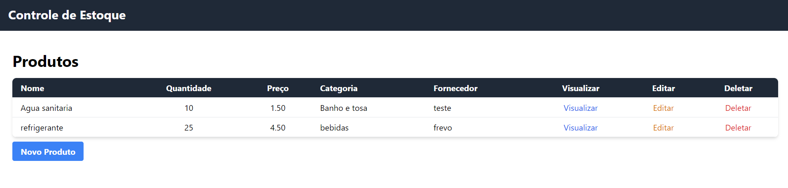
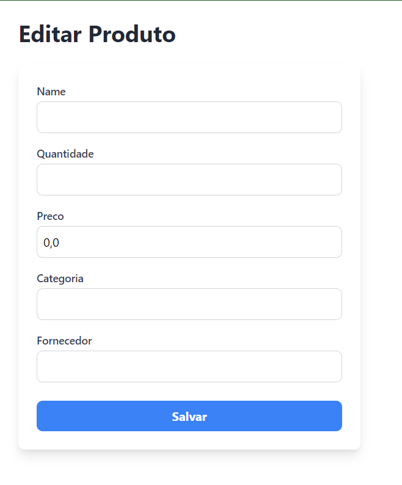
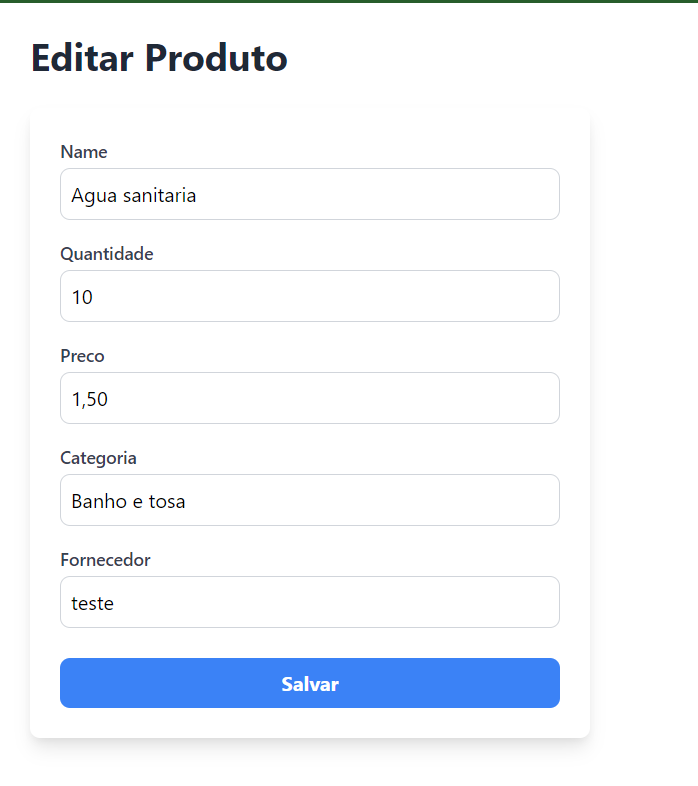
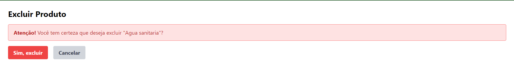

# **Controle de Estoque - Projeto de Back-End (1ª Unidade)**

## **Descrição do Projeto**

Este é o projeto da primeira unidade da disciplina de back-end do 4º período, desenvolvido por Rayane Kelly, Ana Rodrigues, Rogério Rodrigues, Ana Silva e Luiz Sacramento. O objetivo do projeto é construir uma aplicação CRUD (Create, Read, Update, Delete) para o controle de estoque, utilizando o framework Django e o banco de dados SQLite para gerenciar e armazenar as informações.

A aplicação permite o gerenciamento completo dos itens de estoque, oferecendo uma interface simples para que o usuário possa adicionar, visualizar, editar e excluir produtos. Com essa solução, é possível monitorar de forma eficiente a quantidade de itens disponíveis e suas respectivas movimentações.

---

## **Tecnologias Utilizadas**

- **Django:** Framework web em Python que facilitou o desenvolvimento do back-end.
- **SQLite:** Banco de dados relacional leve e fácil de usar, integrado com o Django.
- **Python 3.10:** Linguagem de programação usada para o desenvolvimento da aplicação.
- **Tailwind CSS:** Framework CSS utilizado para estilizar as páginas de forma rápida e eficiente.
- **HTML/CSS:** Tecnologias básicas para a renderização de templates no front-end.

---
---

## **Capturas de Tela**

### **Tela Inicial - Listagem de Produtos**



### **Tela de Cadastro de Produto**



### **Tela de Edição de Produto**



### **Tela de Deletar Produto**



---
## **Estrutura do Diretório**

Aqui está uma visão geral da estrutura de pastas do projeto:


- **`manage.py`**: Script que facilita a execução de comandos administrativos, como migrações, execução do servidor, etc.
- **`db.sqlite3`**: Banco de dados SQLite utilizado para armazenar as informações do estoque.
- **`estoque`**: Diretório que contém o código principal da aplicação. Inclui as views (responsáveis pela lógica do CRUD), templates (HTML), models (definição das tabelas no banco), e urls (responsáveis pelo roteamento).

---

## **Funcionalidades**

1. **Cadastrar Produtos**: Permite adicionar novos itens ao estoque com informações como nome, quantidade e preço.
2. **Visualizar Produtos**: Exibe a lista de produtos no estoque.
3. **Editar Produtos**: Permite atualizar informações de um item do estoque.
4. **Deletar Produtos**: Remove itens do estoque quando não forem mais necessários.

---

## **Como Executar o Projeto**

1. Clone o repositório:
   ```bash
   git clone https://github.com/Rayane-Souza/EstoqueControle.git
2. Entre no diretório do projeto:
   ```bash
   cd .\my_project\
3. Execute o servidor:
   ```bash
   python manage.py runserver
## Contribuidores

* Ana Silva
* Ana Rodrigues
* Luiz Sacramento
* Rayane Kelly
* Rogério Rodrigues


